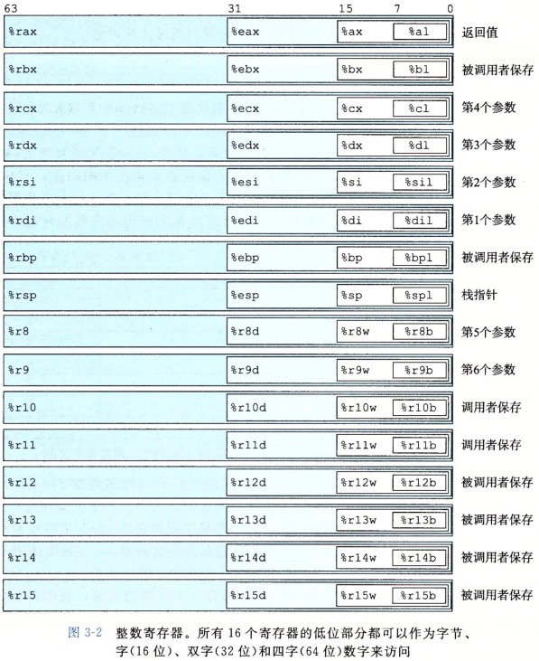
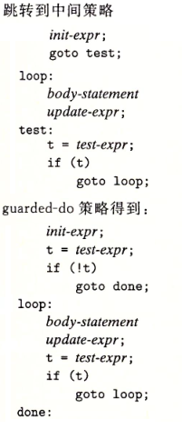

<a name="4410"/>

小结

1.栈帧执行的流程，x86_64的现代处理流程

2.数据访问和操作模式

3.多种控制形式的通用写法

4.数组的机器级表示，指针的机器级含义

5.缓冲区溢出的保护机制

6.结构和联合的内存对齐

 

编译过程

编译过程与机器代码

机器代码：用字节序列编码低级的操作

汇编代码：机器代码的文本表示

GCC编译过程

编译器：根据源码产生汇编代码(*.s)  gcc -O1 -S code.c

汇编器：将汇编代码转换成二进制目标代码文件(*.o) =&gt; 机器代码的一种形式，但没有填入全局变量的地址  gcc -O1 -c code.c

链接器：将多个目标代码文件与库函数合并，产生可执行文件 =&gt; 机器代码的最终形式，供处理器执行

反汇编 disassembler：将二级制目标代码文件转换为汇编代码    objdump -d code.o

 

机器级编程的两个重要抽象

1.机器级程序的格式和行为：指令集体系结构 Instruction set architecture-ISA

    =&gt; 将程序的行为描述成好像每条指令顺序执行（定义处理器状态、指令格式、指令对状态的影响）

    =&gt; 处理器硬件实际上并发执行，到保证整体行为与ISA的顺序一致

 

2.机器级程序使用的存储器是虚拟地址：

    =&gt; 将存储器模型抽象为一个连续的大字节数组

    =&gt; 实际上存储器是由多个硬件存储器和操作系统软件组合而成

 

C语言提供相对比较抽象的执行模型

隐藏以下处理器状态

1.程序计数器 %eip

2.整数寄存器

3.条件码寄存器

4.浮点寄存器

 

 

访问信息

    

 

    

    

 

    

 

 

数据传送指令

1.传送指令的两个操作数不能都指向存储器位置

2.从较小的源数据复制到较大的数据：符号位扩展（MOVS），零扩展（MOVZ）

3.%esp保存栈顶元素位置

4.压入栈中，%esp-4 =&gt;按字节寻址

5.局部变量保存在寄存器中，而不是存储器里 =&gt; 速度更快

6.以下定义的数据传送指令：

    

 

算术与逻辑运算

1.分成4组：加载有效地址(LEAL)、一元操作（INC/DEC/NEG/NOT）、二元操作（ADD/SUB/IMUL/XOR/OR/AND）、移位（SAL/SHL/SAR/SHR）

2.LEAL：加载有效地址 load effective address =&gt;将有效地址写入目的操作数，类似于产生指针

3.移位量用单字节编码 =&gt; 只允许0-31位的移位，只考虑低5位

4.区分右移指令：SAR 算术移位（符号位扩展）  SHR 逻辑移位（零扩展）

5.特殊的算术操作 =&gt; 表示64位整数     %edx-余数  %eax -商

 

    

    

 

控制

状态码

1.实现有条件行为的机制：测试数据值指令 + 条件跳转指令

2.条件码 condition code =&gt; %elf 条件码寄存器

CF        进位标志，是否溢出

ZF        零标志，结果是否为0

SF        符号标志，是否为负数

OF        溢出标志，是否补码溢出

3.LEAF指令不改变任何条件码，只是用来计算地址

4.测试指令只改变条件码而不改变任何寄存器

    

5.访问条件码指令 =&gt; 获取条件码，作为比较运算符的结果

    

cmpl %eax, %edx

setl %al

相当于比较 int &lt; int

 

跳转指令

1.汇编时（生成目标代码文件）会确定所有带标号指令，并将跳转目标（目的指令地址）编码为跳转指令的一部分

2.两类跳转指令：无条件跳转（直接跳转/间接跳转）、条件跳转

    

3.间接跳转（与程序计数器相关PC）=&gt; 指令的偏移地址+下一指令地址（%eip）=&gt; 便于移到存储器的不同位置

4.直接跳转 jmp *Operand

5.条件分支的通用形式

    

6.do-while循环的通用形式

    

7.while循环的通用形式

    第一种翻译方法：跳转到中间形式 jump to middle

    

    

    第二种翻译方法：guarded-do

    

8.for循环的通用形式：

    

 

9.switch语句的通用形式：=&gt; 基于跳转表

    

 

10.条件传送指令 =&gt; 替代传统的利用控制的条件转移，改用数据的条件转移

1.性能更好，通过使用流水线获得高性能 =&gt; 分支预测错误处罚主导函数的性能

2.控制流不依赖于数据，使得处理器更容易保持流水线是满的

3.不是所有的条件表达式都可以使用条件传送指令 =&gt; 当分支会产生副作用时，不适用

        当条件满足时，指令将S值复制到R中

    

 

过程

栈帧

1.过程调用：将数据（参数和返回值）和控制（返回地址）从一个函数到另一个函数

2.数据传递、局部变量的分配和释放通过操作程序栈来实现

3.栈帧的结构

    

    %ebp    帧指针，用于界定栈帧的范围

    %esp    栈指针，用于指向栈顶

    用栈来保存不能存在在寄存器中的局部变量

 

过程转移控制指令

    

    call        过程调用，将返回地址(下一指令的地址%eip)入栈，占4个字节

    ret        从栈中弹出地址，并跳转到这个位置（下一指令）

    leave    使栈做好返回的准备（恢复栈帧，恢复被调用函数中保存的%ebp），等价于

movl    %ebp,%esp

pop    %ebp

 

寄存器使用惯例

调用者保存寄存器        %eax,%edx,%ecx

被调用者保存寄存器    %ebx,%esi,%edi

函数内保存                  %ebp,%esp

gcc坚持函数使用的栈空间是16字节的整数倍，为了保证访问数据的严格对齐

 

递归过程

利用栈规则，在每次函数调用时保存自己的私有状态信息，使用%eax返回结果

 

数组分配

1.C语言实现的数组方式与机器代码操作的存储器一致，都是连续的字节数组 =&gt; 翻译成地址计算

2.基本原则：利用（基址+偏移量）寻址方式 M(%edx,%exc,4)

3.利用LEAL指令产生地址，利用内存寻址获取值

    

4.多维数组的存储器地址计算方式

对于数组X[R][C]，每个元素长度为L

&amp;D[i][j] = &amp;X + L(C*i + j)

 

变长的数据结构

1.结构体：看做连续内存，编译器保存每个元素（字段）的字节偏移

2.联合：多种类型引用一个对象，使用不同的字段来引用相同的存储器块 =&gt; 利用其获取数据位模式（大小端）

3.数据对齐

    对齐限制：任何K字节基本类型对象的地址必须是K值的整数倍

    好处：1.简化形成处理器和存储器系统硬件接口的设计 2.减少多次存储器访问

    

 

指针

1.每个指针对应一个类型，指针类型并不是及其代码的一部分，其是C语言提供的一种抽象，帮助程序员避免寻址错误

2.每个指针都有一个值，除了NULL

3.指针用&amp;符号创建，机器代码中使用LEAL指令获取

4.运算符*用于指针的间接引用，机器代码中使用存储寻址引用来实现

5.指针的强制类型转换，只改变它的类型，不改变它的值 =&gt; 指针运算的伸缩

6.指针指向函数，机器代码中函数的第一条指令的地址

 

GDB调试器

 

缓冲区溢出

1.缓冲区溢出（buffer overflow）：栈中分配字节数保存字符串，但实际长度产出为数组分配的空间。

2.典型的缓冲区溢出 =&gt; gets/

!!!

3.出现以下可能的错误:

1.破坏%ebx =&gt; 寄存器不能正确恢复，不能依靠这个寄存器的正确性

2.破坏%ebp =&gt; 不能正确引用局部变量或参数

3.破坏返回地址 =&gt; 导致ret跳转到意想不到的地方

4.利用缓冲区溢出的攻击形式 =&gt; 使代码执行不应该执行的函数或外壳程序

5.对抗缓冲区溢出的办法：

  5.1.栈随机化 =&gt; 使栈的位置在程序每次运行时都变化，通过插入0-n个空字节，栈只使用后续的位置

    地址空间布局随机化（Address-Space Layout Randomization） 

    攻击者利用“空操作雪橇 nop sled”划过所有占位序列

    增加攻击者成功攻击系统的难度

  5.2.栈破坏检测 =&gt; 加入栈保护者（stack protetor）来检测缓冲区溢出

    在栈帧中任何局部缓冲区和栈状态之间存储一个特殊的金丝雀值（canary）

    防止缓冲区溢出破坏存储的程序栈上的状态，只在有局部char类型缓存区才插入

        

  5.3.限制可执行代码区域 =&gt; 将读和执行的访问模式分开，消除攻击者插入可执行代码的能力

    限制存放可执行代码的区域

  以上3种方式是最常见、最小成本的防止溢出攻击漏洞。

 

 

x86-64

1.有AMD提出并命名为x86-64，采用精简指令集（RISC）

2.编译器方面，GCC坚持与i386的二进制兼容性，因此传统32位仍旧支持

3.数据类型

    采用64位指针，使得可访问空间提升到2^64，实际只支持2^48（256TB）空间

    提升标准数据类型大小

4.访问信息

    提升寄存器到16个

    支持PC相对操作数寻址方式 =&gt; 0x20H(%rip)

5.过程

    a.参数通过寄存器传递到过程，而不是栈，（最多是前6个）

    b.许多函数不需要栈帧 =&gt; 只有需要在栈上分配局部变量的函数才需要

    c.函数默认可访问%esp +128的栈范围空间，无需修改栈指针，开始时分配整个栈存储，保持固定位置

    d.没有帧指针%ebp，替代为：对栈位置的引用相对于栈指针

    e.参数传递按指定的顺序使用寄存器  %rdi,%rsi,%rdx,%rcx,%r8,%r9

        更多参数使用栈空间 8(%rsp),16(%rsp)

        

    f.栈帧：需要栈的唯一原因是需要保存返回地址（可以认为是调用者的一部分，而不是栈帧）

    g.只在以下情况下需要栈帧：

        1.局部变量过多；

        2.局部变量是数组或结构；

        3.需要用&amp;取局部变量地址；

        4.需要将原栈上参数传递到另一函数；

        5.公用通用寄存器，需要保存状态

call_proc:

    subq    $32,%rsp

    ....

    addq    $32,%rsp

    ret

 

 

浮点数的机器级表示

1.浮点体系结构：x87和SSE

    

2.浮点传送指令

    

 

3.浮点转换指令

 

4.标量浮点算数运算

 

5.浮点位级操作

 

6.浮点比较指令

 

 

资料

Linux汇编语言开发指南

<a href="https://www.ibm.com/developerworks/cn/linux/l-assembly/index.html">https://www.ibm.com/developerworks/cn/linux/l-assembly/index.html</a>

 

 

 

